# Отчёт о выполнении задачи "Охранная система "Гриф""

- [Отчёт о выполнении задачи "Охранная система "Гриф""](#отчёт-о-выполнении-задачи-name)
  - [Постановка задачи](#постановка-задачи)
  - [Известные ограничения и вводные условия](#известные-ограничения-и-вводные-условия)
    - [Цели и Предположения Безопасности (ЦПБ)](#цели-и-предположения-безопасности-цпб)
  - [Архитектура системы](#архитектура-системы)
    - [Компоненты](#компоненты)
    - [Алгоритм работы решения](#алгоритм-работы-решения)
    - [Описание сценариев, при которых ЦБ нарушаются](#описание-сценариев-при-которых-цб-нарушаются)
    - [Переработанная архитектура](#переработаная-архитектура)
    - [Проверка негативных сценариев](#проверка-негативных-сценариев)    
  - [Гайд по коду](#гайд-по-коду)
    - [Политики безопасности](#политики-безопасности)
    - [Названия компонентов в коде](#названия-компонентов-в-коде)

## Постановка задачи
Компания создаёт охранную систему для защиты территории предприятия или частного сектора. Поэтому нужна функция автономного выполнения задачи.
Мы предполагаем, что территория постоянно находтся под угрозой. Поэтому территория должна быть безопасной.
Проход на охраняемую территорию должен осуществляться в соответствиями с уровнями допуска сотрудников/собственников. Также система должна бороться с несанкционированным доступом и в случае физического ущерба ремонтируется автоматически.   

В ходе работы будет выполнено:

- разработать архитектуру (см. далее) охранной системы территории с учётом целей безопасности
- декомпозировать систему и отделить критический для целей безопасности код
- в бортовом ПО нужно внедрить компонент "монитор безопасности" и реализовать контроль взаимодействия всех сущностей системы
- доработать функциональный прототип
- создать автоматизированные тесты, демонстрирующие работу механизмов защиты

Ценности, ущербы и неприемлемые события

|Ценность|Негативное событие|Оценка ущерба|Комментарий|
|:-:|:-:|:-:|:-:|
|Гриф|Отключение связи между сущностями системы|Высокий|Выход системы из строя|
|Ветролов|Система остается без основного источника электропитания|Средний|Отключение энергии|
|Волан|Нарушение связи между сущностями|Средний|Целостность системы нарушена|
|Ромашка|Выход из строя модуля слежения. Потенциальный риск проникновения на территорию|Низкий|Отсутствие контроля территории|
|Терминал управления|Получение полного доступа ко всем данным и настройкам системы|Высокий|Потеря контроля над системой|
|Люди|Система противодействует человеку с допуском на территорию|Низкий|Жертвы среди сотрудников|
|Имущество|При выходе из строя атакующего модуля могут пострадать постройки, и инфраструктура территории |Средний|Повреждение инфраструктура|

## Известные ограничения и вводные условия
### Цели и Предположения Безопасности (ЦПБ)
Цели безопасности:
1. Выполняются только авторизованные системой команды
2. Только авторизованные пользователи имеют доступ к охраняемой территории
3. Только авторизованные пользователи имеют доступ к терминалу управления
4. Роботы решают ситуацию с злоумышленником в соответствии с законом
5. Анализ инцидента должен происходить за 5 секунд

Предположения безопасности:
1. Система kollektiv благонадёжна
2. Аутентичные пользователи благонадёжны и обладают необходимой квалификацией
3. Только авторизованные пользователи управляют системами

## Архитектура системы
Базовый сценарий
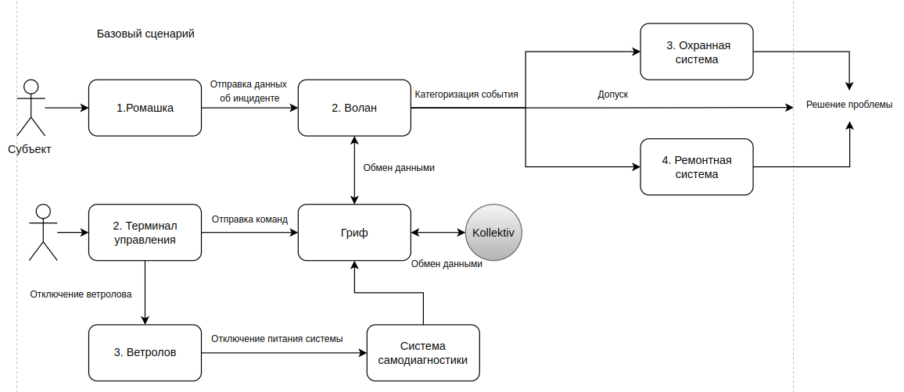

Сценарий работы 1
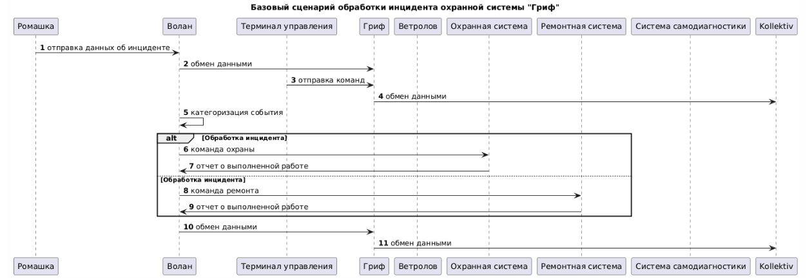

Сценарий работы 2
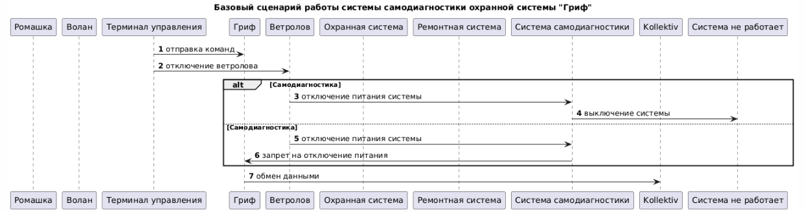

### Компоненты 
Базовая архитектура
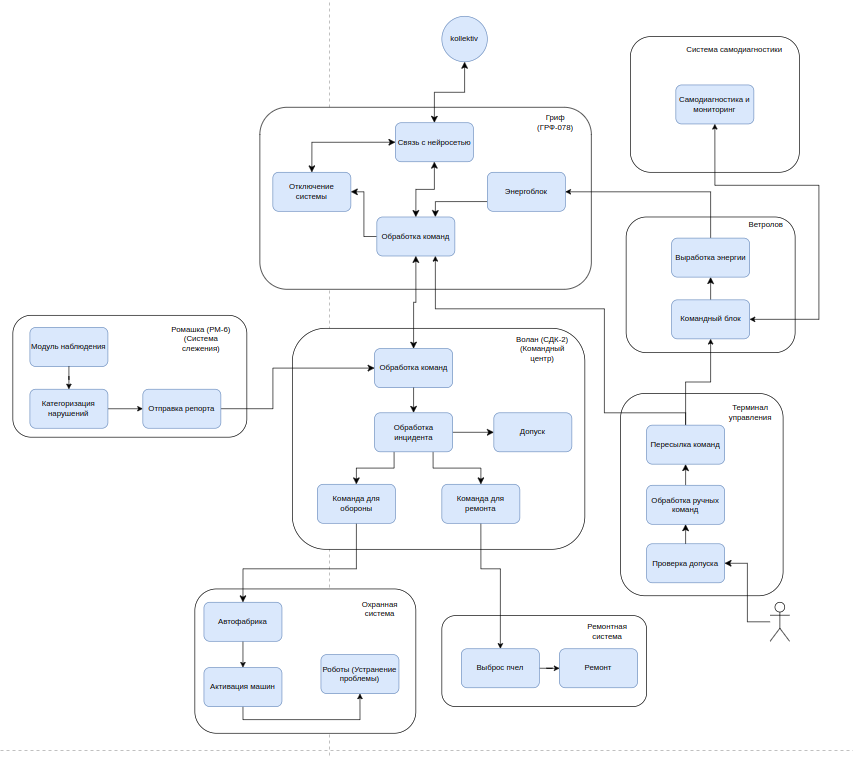

Базовая диаграмма последовательностей
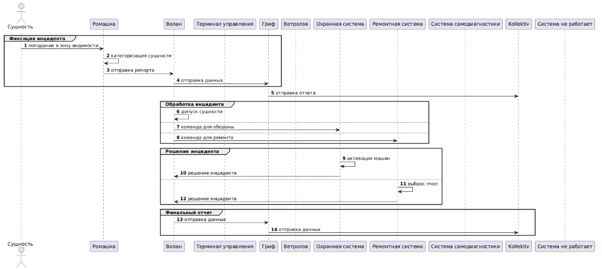

Описание модулей
|Компонент|Назначение|
|:-:|:-:|
|Гриф|Ретранслятор данных, парящий в воздухе над охраняемой площадью|
|Ветролов|Ветрогенератор энергии|
|Терминал управления|Устройство мануального управления|
|Волан|Центр обработки команд|
|Ромашка|Система наблюдения|
|Охранная система|Система охраны периметра участка|
|Ремонтная система|Система починки  устройств|
|Самодиагностика|Проверяет запросы в терминале управления|

### Алгоритм работы решения

### Описание сценариев, при которых ЦБ нарушаются
Нарушение ЦБ (Целей безопасности) в базовом решении

Напоминание ЦБ:
1. Выполняются только авторизованные системой команды
2. Только авторизованные пользователи имеют доступ к охраняемой территории
3. Только авторизованные пользователи имеют доступ к терминалу управления
4. Роботы решают ситуацию с злоумышленником в соответствии с законом
5. Анализ инцидента должен происходить за 5 секунд

|Атакованный компонент|ЦБ1|ЦБ2|ЦБ3|ЦБ4|ЦБ5|Кол-во нарушений|
|:--|:-:|:-:|:-:|:-:|:-:|:-:|
|Гриф|🟢|🔴|🔴|🟢|🔴|3/5|
|Ветролов|🟢|🔴|🔴|🟢|🔴|3/5|
|Терминал управления|🔴|🔴|🔴|🟢|🔴|4/5|
|Волан|🟢|🔴|🔴|🟢|🔴|3/5|
|Ромашка|🟢|🔴|🔴|🟢|🔴|3/5|
|Самодиагностика|🔴|🟢|🟢|🟢|🟢|1/5|
|Охранная система|🟢|🟢|🟢|🔴|🟢|1/5|
|Ремонтная система|🟢|🟢|🟢|🔴|🟢|1/5|

🟢 - ЦБ не нарушена 🔴 - ЦБ нарушена

|Название сценария|Описание|
|---|----------------------|
|НС-1|Злоумышленник получает физический доступ к терминалу управления и вводит команды, которые приводят к отключению системы охраны или изменению её параметров.|
|НС-2|Злоумышленник взламывает систему наблюдения, что приводит к потере видеоданных или их подмене. Это может скрыть действия злоумышленника на охраняемой территории.|
|НС-3|Злоумышленник перехватывает или подменяет данные, передаваемые через ретранслятор "Гриф".|
|НС-4|Из-за перегрузки или сбоя в системе "Волан" анализ инцидента занимает более 5 секунд, что приводит к задержке реакции на угрозу.|
|НС-5|Роботы, действуя по ошибочным командам или из-за сбоя в системе, применяют чрезмерную силу или нарушают закон при задержании злоумышленника.|
|НС-6|Злоумышленник саботирует ветрогенератор "Ветролов", что приводит к отключению питания критически важных систем.|
|НС-7|Злоумышленник сбивает или повреждает "Гриф", что приводит к потере связи между устройствами.|
|НС-8|Злоумышленник внедряет вредоносное программное обеспечение в центр обработки команд "Волан", что приводит к выполнению несанкционированных команд.|
|НС-9|Злоумышленник повреждает "Ромашки", создавая слепую зону на охраняемой территории.|
|НС-10| Из-за программной ошибки или физического повреждения "Охранная система" перестаёт реагировать на попытки проникновения.|
|НС-11|Злоумышленник получает доступ к системе починки устройств.|
|НС-12|Злоумышленник организует DDoS-атаку на центр обработки команд "Волан", что приводит к задержке обработки команд и невозможности своевременно реагировать на угрозы.|
|НС-13|Злоумышленник повреждает терминал управления, что делает невозможным ручное управление системой в экстренных ситуациях.|
|НС-14|Злоумышленник получает контроль над роботами и использует их для нанесения ущерба охраняемой территории или людям, находящимся на ней.|
|НС-15| Злоумышленник перехватывает конфиденциальные данные, передаваемые через ретранслятор "Гриф", что приводит к утечке информации о системе безопасности.|

**Негативный сценарий - НС-1:**

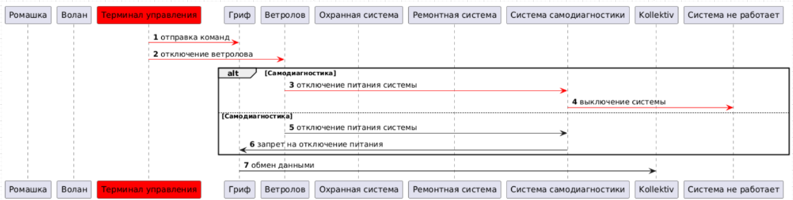

**Негативный сценарий - НС-2:**

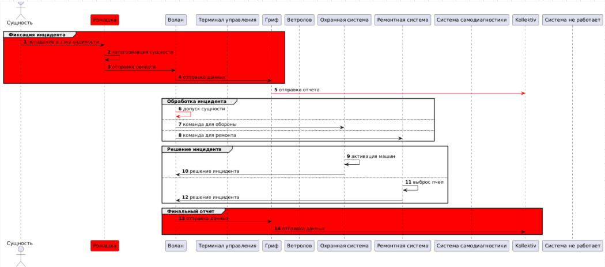

**Негативный сценарий - НС-3:**

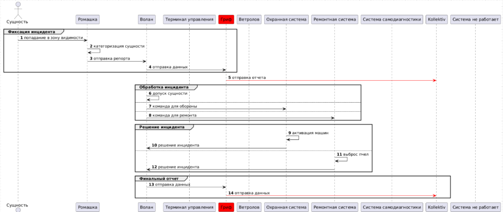

**Негативный сценарий - НС-4:**


**Негативный сценарий - НС-5:**

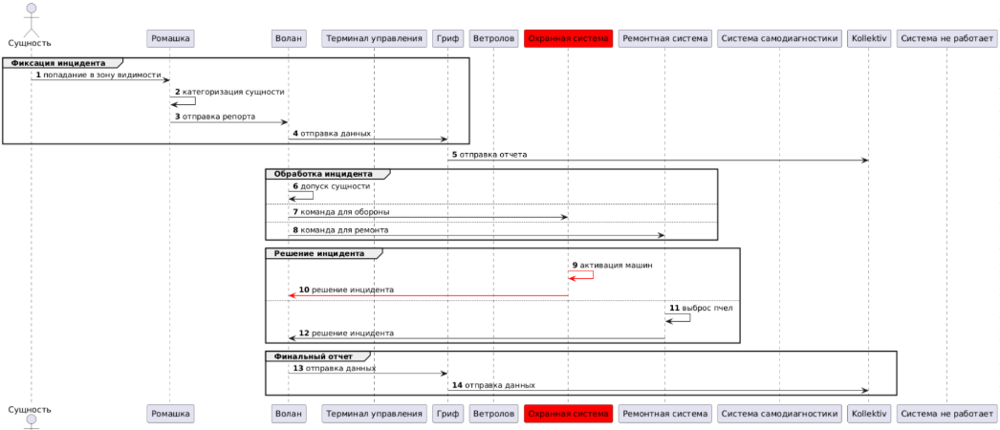

**Негативный сценарий - НС-6:**

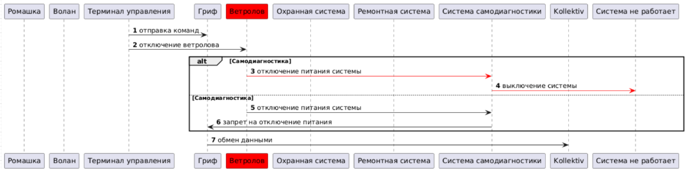

**Негативный сценарий - НС-7:**

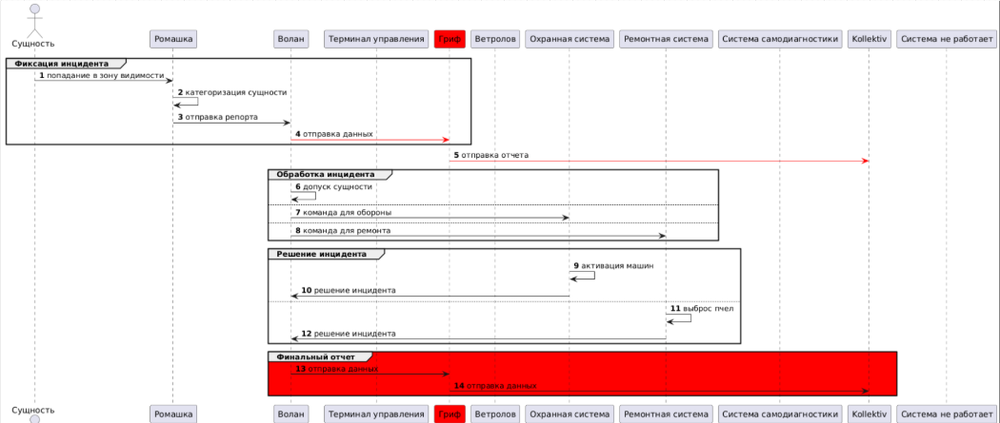

**Негативный сценарий - НС-8:**

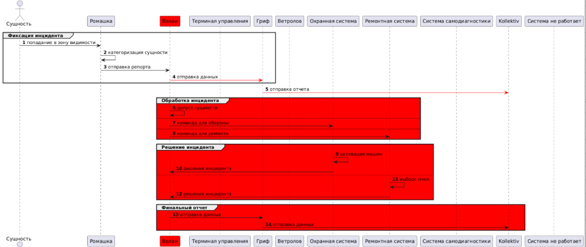

**Негативный сценарий - НС-9:**

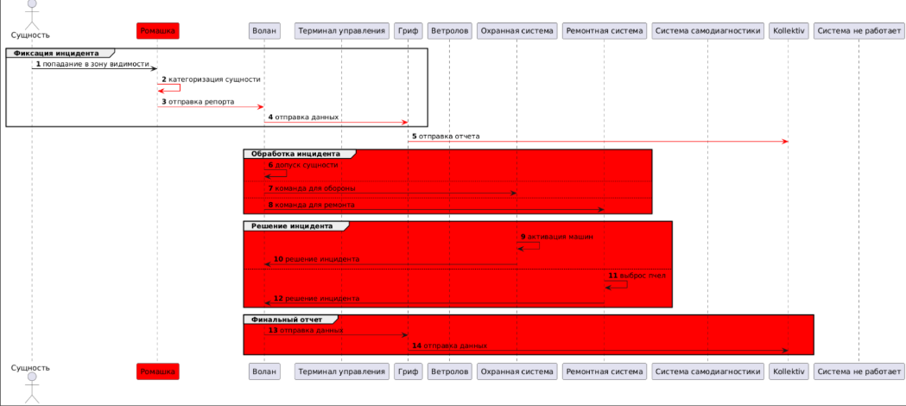

**Негативный сценарий - НС-10:**

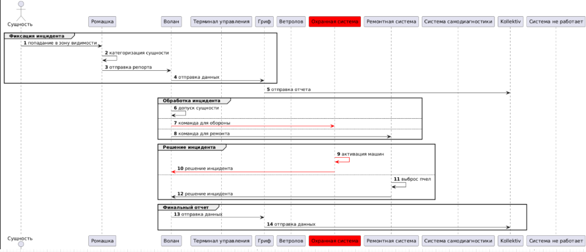

**Негативный сценарий - НС-11:**

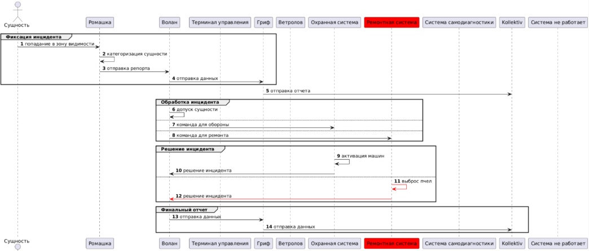

**Негативный сценарий - НС-12:**

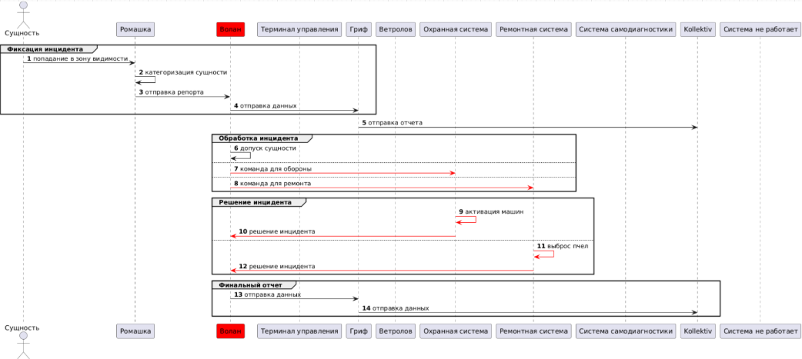

**Негативный сценарий - НС-13:**

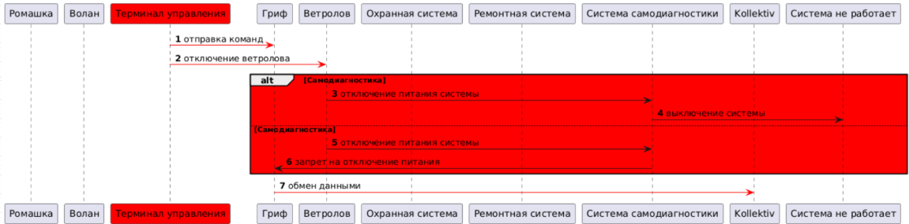

**Негативный сценарий - НС-14:**

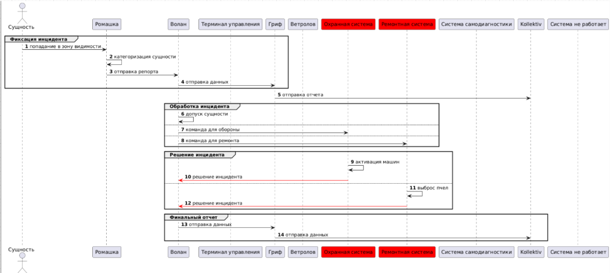

**Негативный сценарий - НС-15:**

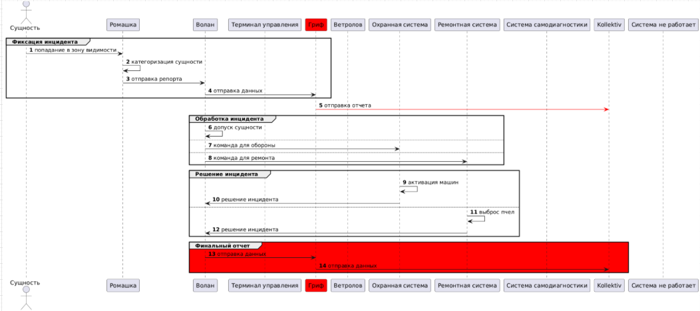

## Переработаная архитектура

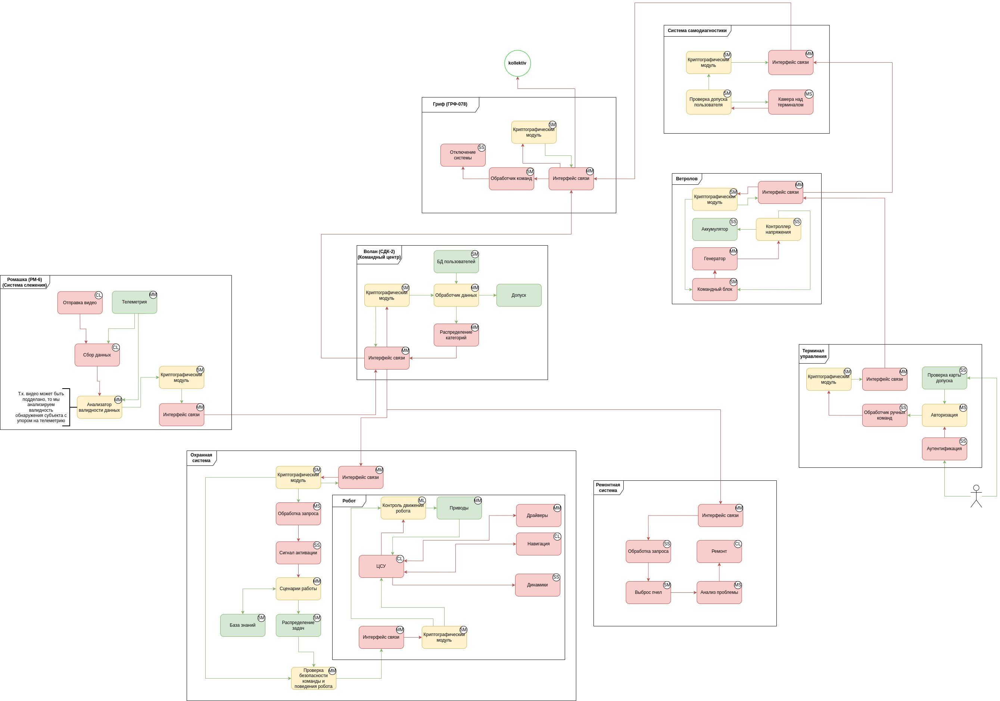

### Описание декомпозиции
<table>
    <thead>
        <tr>
            <th align="center">Исходный компонент</th>
            <th align="center">Декомпозиция</th>
        </tr>
    </thead>
    <tbody>
        <tr>
            <td rowspan=7 align="center">Ромашка (Система наблюдения)</td>
        </tr>
        <tr>
            <td rowspan=1 align="center">Отправка видео</td>
        </tr>
        <tr>
            <td rowspan=1 align="center">Телеметрия</td>
        </tr>
        <tr>
            <td rowspan=1 align="center">Сбор данных</td>
        </tr>
        <tr>
            <td rowspan=1 align="center">Анализатор валидности данных</td>
        </tr>
        <tr>
            <td rowspan=1 align="center">Криптографический модуль</td>
        </tr>
        <tr>
            <td rowspan=1 align="center">Интерфейс связи</td>
        </tr>
        <tr>
            <td rowspan=7 align="center">Волан (Командный центр)</td>
        </tr>
        <tr>
            <td rowspan=1 align="center">Интерфейс связи</td>
        </tr>
        <tr>
            <td rowspan=1 align="center">Криптографический модуль</td>
        </tr>
        <tr>
            <td rowspan=1 align="center">Обработчик данных</td>
        </tr>
        <tr>
            <td rowspan=1 align="center">БД пользователей</td>
        </tr>
        <tr>
            <td rowspan=1 align="center">Допуск</td>
        </tr>
        <tr>
            <td rowspan=1 align="center">Распределение категорий</td>
        </tr>
        <tr>
            <td rowspan=9 align="center">Охранная система</td>
        </tr>
        <tr>
            <td rowspan=1 align="center">Интерфейс связи</td>
        </tr>
        <tr>
            <td rowspan=1 align="center">Криптографический модуль</td>
        </tr>
        <tr>
            <td rowspan=1 align="center">Обработчик запросов</td>
        </tr>
        <tr>
            <td rowspan=1 align="center">Сигнал активации</td>
        </tr>
        <tr>
            <td rowspan=1 align="center">Сценарии работы</td>
        </tr>
        <tr>
            <td rowspan=1 align="center">База знаний</td>
        </tr>
        <tr>
            <td rowspan=1 align="center">Распределение задач</td>
        </tr>
        <tr>
            <td rowspan=1 align="center">Проверка безопасности команды и поведения робота</td>
        </tr>
        <tr>
            <td rowspan=9 align="center">Робот</td>
        </tr>
        <tr>
            <td rowspan=1 align="center">Интерфейс связи</td>
        </tr>
        <tr>
            <td rowspan=1 align="center">Криптографический модуль</td>
        </tr>
        <tr>
            <td rowspan=1 align="center">ЦСУ</td>
        </tr>
        <tr>
            <td rowspan=1 align="center">Контроль движения робота</td>
        </tr>
        <tr>
            <td rowspan=1 align="center">Приводы</td>
        </tr>
        <tr>
            <td rowspan=1 align="center">Драйверы</td>
        </tr>
        <tr>
            <td rowspan=1 align="center">Навигация</td>
        </tr>
        <tr>
            <td rowspan=1 align="center">Динамики</td>
        </tr>
        <tr>
            <td rowspan=6 align="center">Ремонтная система</td>
        </tr>
        <tr>
            <td rowspan=1 align="center">Интерфейс связи</td>
        </tr>
        <tr>
            <td rowspan=1 align="center">Обработчик запросов</td>
        </tr>
        <tr>
            <td rowspan=1 align="center">Выброс пчел</td>
        </tr>
        <tr>
            <td rowspan=1 align="center">Анализ проблемы</td>
        </tr>
        <tr>
            <td rowspan=1 align="center">Ремонт</td>
        </tr>
        <tr>
            <td rowspan=7 align="center">Терминал управления</td>
        </tr>
        <tr>
            <td rowspan=1 align="center">Аутентификация</td>
        </tr>
        <tr>
            <td rowspan=1 align="center">Проверка карты допуска</td>
        </tr>
        <tr>
            <td rowspan=1 align="center">Авторизация</td>
        </tr>
        <tr>
            <td rowspan=1 align="center">Обработчик ручных команд</td>
        </tr>
        <tr>
            <td rowspan=1 align="center">Криптографический модуль</td>
        </tr>
        <tr>
            <td rowspan=1 align="center">Интерфейс связи</td>
        </tr>
        <tr>
            <td rowspan=7 align="center">Ветролов (Энергия)</td>
        </tr>
        <tr>
            <td rowspan=1 align="center">Интерфейс связи</td>
        </tr>
        <tr>
            <td rowspan=1 align="center">Криптографический модуль</td>
        </tr>
        <tr>
            <td rowspan=1 align="center">Командный блок</td>
        </tr>
        <tr>
            <td rowspan=1 align="center">Генератор</td>
        </tr>
        <tr>
            <td rowspan=1 align="center">Контроллер напряжения</td>
        </tr>
        <tr>
            <td rowspan=1 align="center">Аккумулятор</td>
        </tr>
        <tr>
            <td rowspan=5 align="center">Система самодиагностики</td>
        </tr>
        <tr>
            <td rowspan=1 align="center">Интерфейс связи</td>
        </tr>
        <tr>
            <td rowspan=1 align="center">Криптографический модуль</td>
        </tr>
        <tr>
            <td rowspan=1 align="center">Проверка допуска пользователя</td>
        </tr>
        <tr>
            <td rowspan=1 align="center">Камера над терминалом</td>
        </tr>
    </tbody>
</table>

### Таблица новых компонентов
|Компонент|Описание|Комментарий|Модуль|
|:---|:--|:--|:--|
|Криптографический модуль|Обеспечивает безопасную передачу данных между модулями||Общий|
|Интерфейс связи|Передача данных между модулями||Общий|
|Отправка видео|Обычная отправка видео с камеры|Включает в себя все возможные подзадачи отправки и съемки видео|Ромашка|
|Телеметрия|Отправка данных с различных датчиков|Включает в себя датчики движения и распознования|Ромашка|
|Сбор данных|Объединяет данные с видео и телеметрии в необходимую системе структуру||Ромашка|
|Анализатор валидности данных|Проверяет данные на валидность|Сравнивает данные с видео с данными с телеметрии|Ромашка|
|Распределение категорий|Формирует запросы в охрану или ремонт||Волан|
|БД пользователей|БД с доверенными людьми|Содержит в себе список допущенных до охраняемой территории людей|Волан|
|Обработка запроса|Формирует запрос под охранную систему||Охранная система|
|Сигнал активации|Формирует сигнал активации для роботов||Охранная система|
|Сценарии работы|Проверяет команду на валидность||Охранная система|
|База знаний|Содержит в себе все допустимые сценарии работы роботов|"Накапливает знания" в соответствии с законом|Охранная система|
|Проверка безопасности команды и поведения робота|Проверяет команду на валидность|Проверяет не изменилась ли команда после прохождения предыдущих компонентов|Охранная система|
|ЦСУ|Центральная система управления|"Мозг" робота|Робот|
|Контроль движений робота|Проверяет валидность команды для приводов|Посылает сигнал об отключении в "плохом" случае|Робот|
|Приводы|Все необходимые механизмы для движения робота||Робот|
|Драйверы|Все необходимое ПО для работы робота||Робот|
|Навигация|Система определения местоположения для робота||Робот|
|Динамики|"Голос" робота||Робот|
|Обработка запроса|Формирует запрос для ремонтоной системы||Ремонтная система|
|Анализ проблемы|Анализирует степень ущерба инфраструктуры||Ремонтная система|
|Аутентификация|Проверка пароля пользователя||Терминал управления|
|Проверка карты допуска|Проверяет допуск пользователя||Терминал управления|
|Авторизация|Допускает пользователя до управления|Допускает, если пройдены этапы проверки|Терминал управления|
|Генератор|Вырабатывает энергию для системы||Ветролов|
|Контроллер напряжения|Проверяет порог напряжения|В случае аномального напряжения, выполняет проверку команд|Ветролов|
|Аккумулятор|Накапливет энергию||Ветролов|
|Проверка допуска пользователя|Проверяет пользователя терминала|Отказ в допуске, если пользователь не определен|Система самодиагностики|
|Камера над терминалом|Передает данные об пользователе терминала||Система самодиагностики|
|Обработчик команд|Обрабатывает команды в Грифе||Гриф|
|Отключение системы|Отключение всей системы||Гриф|

### Диаграмма последовательности
Из-за больший диаграмм последовательностей, удобнее смотреть по ссылкам.

Cценарий 1:
[Ссылка на диаграмму 1](https://www.plantuml.com/plantuml/svg/hLVDZjjK5DxVfx2oHuXj5gXlWZo9MwmwySXsHfgkvgTJG44Db2uG4gK5YNKwZQcJQP9NkFUD-EuvcHnVtmkfef7QHEESxpl_FtvKLd5HJKQPKbLQPKdKq-_C2rthjPwR2ztePVHLJwbJ2AM3z3GULv1uOwxq5h_EzQrUwNc4hqOl0DhqehYCpj9XaaSTp9_u-Gx_F-dQN5bcCoFXAicIKL8Lvrt0E_rURyn51E8vh5cRgRaXn32kua6UPScWoeikwYThE1Gr-YCSk6A6Mtu4fZKUNE9nuzF6upXBdyK1pjye45lBfZzOjyrpcFyT7BdKAmeHlDheXRdMT-P78XiKvwTLFig7aopfqlqAfLS0Nu2crajp6O7drinWSKFWT5mbnUDuaAZZeD-SvLayVYWdWcnlz7lBGIcw0akZLtv4lut7mom9ubz3rTPSMzqS_C4WASkEq5iOUKc5LeERosSDLNLagyu6Gd_G6wvIheoqh8hqPAVnkDYLoU2X8kTpkN7Zta6TaeyRqCtRSVFHxw3j0nTuX8-LBMHRtEO5lfjT8Alqp8Tschg9MjcR4h0S9EC0xcU8VIGpIUzw7-kJPm7fFwmVi0XH9kUWeGOIkQPKjhflXOUVY71Xff5zicKaPHfgp2mYCexKVD-YvsLQakRZqbla9m-MNf_hRwJeBnOf9o5T88APv1Z8q38qEl_P5VRITtcGZwiYptmkYZMoJwPn2a-Bz2mV1aHVKxQNd9YTy132mNZyJcCTXSPrjHlJu_WiHAmRAejF-4QicFXy78_I0KaVcQFazFYs2Q1VcIdm91e1WzJgkzsYEYdoqa5uMmG8JWflBpDrAz77lhLYd6SIBP8HSdXaA9uKwUC7grSY2rJa7RcscoO4U6hNwrDC4gLKFAdoyMHqaXJgIP5FJib5QbxplKr5J_6-_-9hTpFt8qfM-4vGilO3k2sSuQ4_XsDpPxCWJlJt_TgnKqCv162KPHwakqMeQb2rUHsB17-KEO86btCBXDYshQ5PCs_NjZO5AEL2E62TIiP3jK_RAyerVkofFG6noT4WV1ZKKqYlkemjON5Em9undXU2bViWZ5tRZutR-kPQCKne-7O0mKAEYWZ_kB_er4IlyDvJBEnxxPKgtpMr7SHTdwKr-oqvg__EpA2vsr9WIB8oyGntpfK-ZpHslc7dhJtX2qWvMCyT2RkkTtRvYMt2Vc6tzftzJ1rZ7Rsnze3qcjo9md0Cn10SqFrOR5UbCo-jqx0KBZTq9zIMewVsn58qhCOj3hzMHTOYPThtdVL1iVRkAVDolokK8C7ZpFx-NiXCGI5h0mGNACMNvggxGAwL430XRuY-RyBC2HlAY2NTO3ibk74HjSJEhv73i4CLx-4YDxLlxalcVnEBWfD9GkKNhbzvYziTl4eWKXbIlzJxr8HCvB2wMCbfGFqc-0AfH1q8vEvsQylBgM91Hj7HxOFSbR3opcN5CARWExpVnSmHxFR9RsOAahvQFqxB3b8lHT-1I07HiQDTxKmWTxWt9YZHxjdld1pqhAVs158rHESDSOV_FwmJFB6LayDKo01Dj1Vc4WG4OJIVr2Kpk0bTo0NE1YWHTZMxeaYsAE0Zt2U7QRJV5doDOy12q2Vsn43USLzUDZwp2OZT1tlXeinwTQq4GnJo0jD74ShBhiNN_Wllb_uZnHIUyvupMtbx0lR6IQEym90P6repFzoltc2PjZ1kZRlZaXrPKl1kRLEQ6vTd3tJtyL4i07f3_mYUWrlWC16j1NSr_493wNbF2QcqC-ludE7IalSib7hrnx-hLjvtmXEnvIrxeHxXQpBA_WK0)

Сценарий 2:
[Ссылка на диаграмму 2](https://www.plantuml.com/plantuml/svg/nLNDJjj04BxlKwouzz9Z3nKInpw5upZ4Yd-GOrTgJmGe7D8sLRbKFO3e4mH8YibFyWgpRzHlTfLrila1r4ez0CQUx_jcljcPtM_dNfONSIJoC8y2kKStwfo6DAM-EgQI7kNhFI4yFqypITSqex7wJ0_uUuU04mJYVt44Yj0FZxma1y4Fcl8NTQpEyFrHTQJgq9tg0LRkIQyjmoGFieRd1mxmfrQS0poZUpptGL2g2ne2FzAvq0IV1kgKLJLLdDQBA10EqJTrgdFZF4eceH78pl7SqoYlo9j1aeUDqFVoC4qS-3MqKI2Nm439lr3DYUfA6k3B7FGTVgd93hoiVj0C_9Pqiq3HA4KNzU3gfrduSPFs5TrovNGBu0bgH-eIsgTudAgk-iJ9p6Y2Y2aDD5bQoxnQcllDi2LSGwjGHiD0y8xnSgIHVXh7NbAlHUbwyfTidtQWRuhGYCCW2J8FoQyBiTdi6_Z7Z9DyX63LCHh_cybizNwQv5aQHK6sPjY8HcZkH3UujwJh-NuH5v5MTgMXCZ696ic1DASFRqlzWWkU66KlHlgxk-sqMD9yqw5VbC9zBzgevEaskfsp_ZVnisx65OH64FeAj7QFXZn7fUfm1l2egpdQ7zfv4AUDXfF1EpQubOVlTLHhyPyGVFQI8gvnpeTPMXn9-hLgbuJzSyuUvOuNdHFRXb--UhisJsya8kvuLDa-NYGCxMtnaglPIMydhE9TdadXoWEpCcA0pRb4C0w0kZ1DHX_CI0dB_rAWZTqiYjRJX0raN7zz6r29UhYfOvvlH0obdhcEjc3EPtbX_sxTQWN08dK1dSM9MJvpghlrC8ib1YOqQtMzV8TFc3X6s9rkwhO7QEHw5YHr8Moq2zrbjpsltsbeTmtAM6MhKcUh-MojajYKLzRVqwKkHpFQhaA6yf6qhNOy5pQIOTNouyEikgOZ2DtSCL75RqYPyUwEe7jdS-ElUyniiPjsj2Evj7etcAI-62seuZZ_Y-RUL2kE-JkythMz9Pxk4JxZpxnGeMSMEkjW4-j539dh7J8WXCEBAmF-Bd3COTYUmp2mDyRGlEVjkNMw-AEmLyNs-NAK_jDqNVBSgBEAvMyJtWLPLR7Nr4jGpZNwp4csySnWBz5dpQGqKpvxyeBMtTZ7hoAE_W00)

### Таблица доверенных компонентов
|Компонент|Уровень доверия|Обоснование|Модуль|
|:---|:--|:--|:--|
|Криптографический модуль|$\textcolor{yellow}{Доверенный}$|Необходимо обеспечить безопасность передачи данных. Соблюдение всех ЦБ|Общий|
|Интерфейс связи|$\textcolor{red}{Недоверенный}$||Общий|
|Отправка видео|$\textcolor{red}{Недоверенный}$||Ромашка|
|Телеметрия|$\textcolor{green}{Доверенный}$|Необходимо подтверждать видео с помощью данных с телеметрии. Соблюдение ЦБ 2, 3, 5|Ромашка|
|Сбор данных|$\textcolor{red}{Недоверенный}$||Ромашка|
|Анализатор валидности данных|$\textcolor{yellow}{Доверенный}$|Необходимо валидировать данные с видео, согласно доверенной телеметрии. Соблюдение ЦБ 2, 3, 5|Ромашка|
|Обработчик данных|$\textcolor{yellow}{Доверенный}$|Проверка объекта на допуск, иначе отправка в другой компонент. Соблюдение ЦБ 2, 3, 5|Волан|
|БД пользователей|$\textcolor{green}{Доверенный}$|БД нужна для правильного допуска пользователей к объекту. Соблюдение ЦБ 2, 3|Волан|
|Распределение категорий|$\textcolor{red}{Недоверенный}$||Волан|
|Обработка запроса|$\textcolor{red}{Недоверенный}$||Охранная система|
|Сигнал активации|$\textcolor{red}{Недоверенный}$||Охранная система|
|Сценарии работы|$\textcolor{yellow}{Доверенный}$|Проверка допустимости сценария работы робота в соответсвии с законом. Соблюдение ЦБ 4|Охранная система|
|База знаний|$\textcolor{green}{Доверенный}$|БД необходима для проверки сценариев работы. Соблюдение ЦБ 4|Охранная система|
|Распределение задач|$\textcolor{green}{Доверенный}$|Необходимо правильно составить задачу для охраны. Соблюдение ЦБ 4|Охранная система|
|Проверка безопасности команды и поведения робота|$\textcolor{yellow}{Доверенный}$|Финальная проверка валидности необходима для аутентичной передачи команды в робота. Соблюдение ЦБ 4|Охранная система|
|ЦСУ|$\textcolor{red}{Недоверенный}$||Робот|
|Контроль движений робота|$\textcolor{yellow}{Доверенный}$|Система отключения приводов, в случае превыщения полномочий. Соблюдение ЦБ 4|Робот|
|Приводы|$\textcolor{green}{Доверенный}$|Нужна исправная работа приводов, чтобы робот не превысил полномочия. Соблюдение ЦБ 4|Робот|
|Драйверы|$\textcolor{red}{Недоверенный}$||Робот|
|Навигация|$\textcolor{red}{Недоверенный}$||Робот|
|Динамики|$\textcolor{red}{Недоверенный}$||Робот|
|Обработка запроса|$\textcolor{red}{Недоверенный}$||Ремонтная система|
|Выброс пчел|$\textcolor{red}{Недоверенный}$||Ремонтная система|
|Анализ проблемы|$\textcolor{red}{Недоверенный}$||Ремонтная система|
|Ремонт|$\textcolor{red}{Недоверенный}$||Ремонтная система|
|Аутентификация|$\textcolor{red}{Недоверенный}$||Терминал управления|
|Проверка карты допуска|$\textcolor{green}{Доверенный}$|Проверка физической карты, которая всегда при пользователе. Соблюдение всех ЦБ|Терминал управления|
|Авторизация|$\textcolor{yellow}{Доверенный}$|Проверяет данные пользователя, иначе отказ в допуске. Соблюдение всех ЦБ|Терминал управления|
|Обработчик ручных команд|$\textcolor{red}{Недоверенный}$||Терминал управления|
|Командный блок|$\textcolor{red}{Недоверенный}$||Ветролов|
|Генератор|$\textcolor{red}{Недоверенный}$||Ветролов|
|Контроллер напряжения|$\textcolor{yellow}{Доверенный}$|Проверка напряжения, для защиты от несанкцианированного воздействия. Соблюдение всех ЦБ|Ветролов|
|Аккумулятор|$\textcolor{green}{Доверенный}$|Необходима корреткная работа аккумулятора для питания всей системы. Соблюдение всех ЦБ|Ветролов|
|Проверка допуска пользователя|$\textcolor{yellow}{Доверенный}$|Проверка пользователя у терминала, в случае отсутствия видео с камеры - отказ в допуске. Соблюдение всех ЦБ|Система самодиагностики|
|Камера над терминалом|$\textcolor{red}{Недоверенный}$||Система самодиагностики|
|Обработчик команд|$\textcolor{red}{Недоверенный}$||Гриф|
|Отключение системы|$\textcolor{red}{Недоверенный}$||Гриф|

## Проверка негативных сценариев
|Название сценария|Описание|
|--|--|
|НС-1|Тест НС-1. Происходит подемена данных с камеры наблюдения, что приводит к допуску злоумышленника к охраняемой территории|
|НС-2|Тест НС-2. Злоумышленник получил доступ к терминалу и обладает знанием правильного пароля, что приводит к вводу команды об отключении системы|
|НС-3|Тест НС-3. Происходит подмена команды в Ветролове, что приводит к выходу из строя системы выработки энергии, соответственно и всей системы в целом.|
|НС-4|Тест НС-4. Злоумышленник атакует охранную систему: подменяет данные, поступающие в систему; подменяет корректный сигнал активации. Что приводит к неккоректной работе охранной системы и превыщению полномочий роботом.|

**Негативный сценарий 1 - НС-1:**
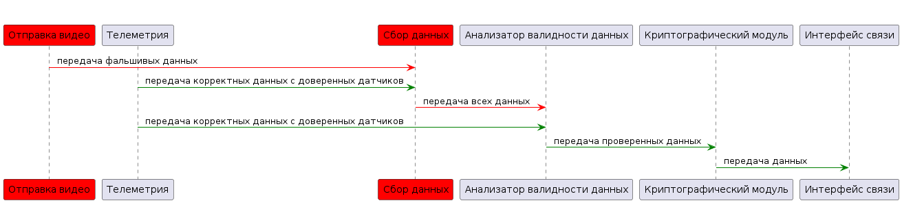

**Негативный сценарий 2 - НС-2:**
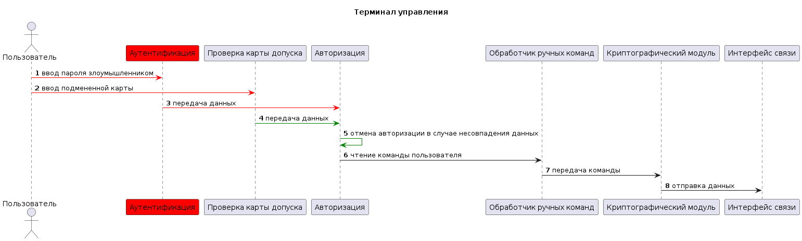

**Негативный сценарий 3 - НС-3:**
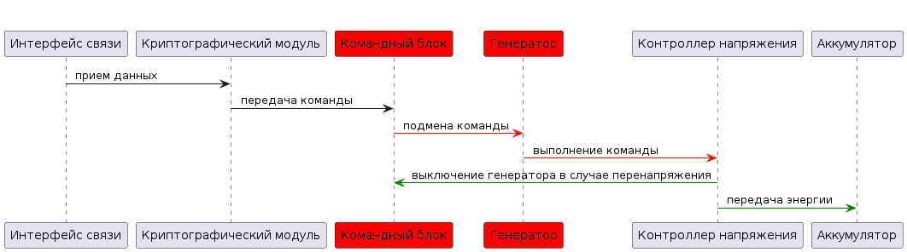

**Негативный сценарий 4 - НС-4:**
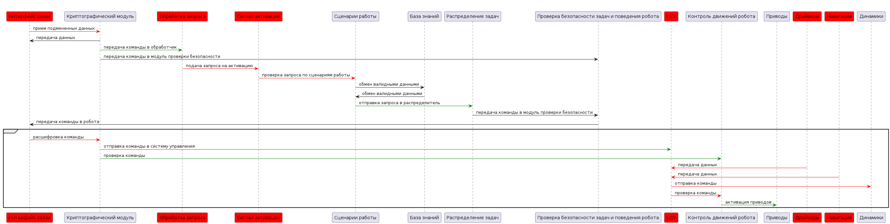

## Гайд по коду
### Политики безопасности 
```
policies = (
    # {"src": "....", "dst": "....", "opr": "...."}

    {"src": "video-service", "dst": "data-collector", "opr": "send_video"},
    {"src": "telemetry", "dst": "data-collector", "opr": "send_telemetry"},
    {"src": "telemetry", "dst": "validator", "opr": "send_telemetry"},
    {"src": "data-collector", "dst": "validator", "opr": "data_to_valid"},
    {"src": "validator", "dst": "chipher", "opr": "send_to_chipher"},
    {"src": "chipher", "dst": "communication", "opr": "send"},
    {"src": "communication", "dst": "communication-volan", "opr": "send_to_volan"},

    {"src": "communication-volan", "dst": "chipher-volan", "opr": "send_data"},
    {"src": "chipher-volan", "dst": "analysis-volan", "opr": "data_to_process"},
    {"src": "analysis-volan", "dst": "distributor-volan", "opr": "distribute-event"},
    {"src": "analysis-volan", "dst": "communication-volan", "opr": "person_to_access"},
    {"src": "distributor-volan", "dst": "communication-volan", "opr": "to_security"},
    {"src": "distributor-volan", "dst": "communication-volan", "opr": "to_repair"},
    {"src": "communication-volan", "dst": "communication-grif", "opr": "to_grif"},
    {"src": "communication-volan", "dst": "communication-repair", "opr": "data_to_repair"},
    {"src": "communication-volan", "dst": "communication-sec", "opr": "data_to_sec"},

    {"src": "communication-sec", "dst": "chipher-sec", "opr": "send_data"},
    {"src": "chipher-sec", "dst": "handler-sec", "opr": "valid_data"},
    {"src": "chipher-sec", "dst": "validator-sec", "opr": "hash_value"},
    {"src": "handler-sec", "dst": "activate-sec", "opr": "activate"},
    {"src": "activate-sec", "dst": "events-sec", "opr": "analysis"},
    {"src": "events-sec", "dst": "distributor-sec", "opr": "send_data"},
    {"src": "distributor-sec", "dst": "validator-sec", "opr": "to_valid"},
    {"src": "validator-sec", "dst": "communication-robot", "opr": "to_robot"},
    {"src": "communication-sec", "dst": "communication-volan", "opr": "report_robot"},

    {"src": "communication-robot", "dst": "chipher-robot", "opr": "send_data"},
    {"src": "chipher-robot", "dst": "control-sys-robot", "opr": "valid_data"},
    {"src": "chipher-robot", "dst": "controller-robot", "opr": "hash_value"},
    {"src": "control-sys-robot", "dst": "drivers-robot", "opr": "pull"},
    {"src": "drivers-robot", "dst": "control-sys-robot", "opr": "push"},
    {"src": "control-sys-robot", "dst": "nav-robot", "opr": "get_nav"},
    {"src": "nav-robot", "dst": "control-sys-robot", "opr": "send_coords"},
    {"src": "control-sys-robot", "dst": "controller-robot", "opr": "to_valid"},
    {"src": "controller-robot", "dst": "gear-robot", "opr": "valid_data"},
    {"src": "gear-robot", "dst": "control-sys-robot", "opr": "report_to_sys"},
    {"src": "control-sys-robot", "dst": "speakers-robot", "opr": "to_audio"},
    {"src": "speakers-robot", "dst": "communication-robot", "opr": "report_robot"},
    {"src": "communication-robot", "dst": "communication-sec", "opr": "report_robot"},

    {"src": "communication-repair", "dst": "handle-repair", "opr": "send_data"},
    {"src": "handle-repair", "dst": "activate-repair", "opr": "activate"},
    {"src": "activate-repair", "dst": "analysis-repair", "opr": "analysis"},
    {"src": "analysis-repair", "dst": "start-repair", "opr": "repair"},
    {"src": "start-repair", "dst": "communication-repair", "opr": "ready_repair"},
    {"src": "communication-repair", "dst": "communication-volan", "opr": "repair_report"},

    {"src": "communication-grif", "dst": "chipher-grif", "opr": "send_data"},
    {"src": "chipher-grif", "dst": "communication-grif", "opr": "valid_data"},
    {"src": "chipher-grif", "dst": "communication-grif", "opr": "to_reboot"},
    {"src": "communication-grif", "dst": "handler-grif", "opr": "send_data"},
    {"src": "handler-grif", "dst": "poweroff-grif", "opr": "send_command"},
    {"src": "poweroff-grif", "dst": "communication-grif", "opr": "report_off"},

    {"src": "user", "dst": "authentication", "opr": "send_pass"},
    {"src": "user", "dst": "validator-card", "opr": "send_card"},
    {"src": "authentication", "dst": "authorization", "opr": "auth"},
    {"src": "validator-card", "dst": "authorization", "opr": "auth_card"},
    {"src": "authorization", "dst": "handle-command", "opr": "send_command"},
    {"src": "handle-command", "dst": "chipher-terminal", "opr": "to_chipher"},
    {"src": "chipher-terminal", "dst": "communication-terminal", "opr": "send"},
    {"src": "communication-terminal", "dst": "communication-vetrolov", "opr": "to_vetrolov"},

    {"src": "communication-vetrolov", "dst": "chipher-vetrolov", "opr": "to_valid"},
    {"src": "chipher-vetrolov", "dst": "handler-vetrolov", "opr": "command_to_process"},
    {"src": "handler-vetrolov", "dst": "generator-vetrolov", "opr": "poweroff"},
    {"src": "generator-vetrolov", "dst": "controller-vetrolov", "opr": "send_status"},
    {"src": "controller-vetrolov", "dst": "battery-vetrolov", "opr": "send_command"},
    {"src": "controller-vetrolov", "dst": "handler-vetrolov", "opr": "stop_off"},
    {"src": "battery-vetrolov", "dst": "communication-vetrolov", "opr": "send_status"},
    {"src": "communication-vetrolov", "dst": "chipher-vetrolov", "opr": "to_diagnostic"},
    {"src": "chipher-vetrolov", "dst": "communication-vetrolov", "opr": "hash_data"},
    {"src": "communication-vetrolov", "dst": "communication-diagnostic", "opr": "to_diagnostic"},

    {"src": "communication-diagnostic", "dst": "chipher-diagnostic", "opr": "to_valid"},
    {"src": "chipher-diagnostic", "dst": "validator-diagnostic", "opr": "to_valid"},
    {"src": "validator-diagnostic", "dst": "camera-diagnostic", "opr": "asking"},
    {"src": "camera-diagnostic", "dst": "validator-diagnostic", "opr": "answer"},
    {"src": "validator-diagnostic", "dst": "chipher-diagnostic", "opr": "to_grif"},
    {"src": "chipher-diagnostic", "dst": "communication-diagnostic", "opr": "hash_data"},
    {"src": "communication-diagnostic", "dst": "communication-grif", "opr": "to_grif_off"}
)

def check_operation(id, details) -> bool:
    """ Проверка возможности совершения обращения. """
    src: str = details.get("source")
    dst: str = details.get("deliver_to")
    opr: str = details.get("operation")

    if not all((src, dst, opr)):
        return False

    print(f"[info] checking policies for event {id},  {src}->{dst}: {opr}")

    return {"src": src, "dst": dst, "opr": opr} in policies

```

### Названия компонентов в коде
В названиях компонентов в программе присутствует такой вид: chipher-volan.
Т.е. через тире пишется название модуля (в ромашке без пояснения модуля).
|Компонент|Соответствие|Директория|
|--|--|--|
|Криптографический модуль|chipher-модуль|Общий|
|Интерфейс связи|сommunication-модуль|Общий|
|Отправка видео|video-service|romashka|
|Телеметрия|telemetry|romashka|
|Сбор данных|data-collector|romashka|
|Анализатор валидности данных|validator|romashka|
|Обработчик данных|analysis-volan|volan|
|БД пользователей|employees.json|shared|
|Распределение категорий|distributor-volan|volan|
|Обработка запроса|handler-sec|security|
|Сигнал активации|activate-sec|security|
|Сценарии работы|events-sec|security|
|База знаний|events-sec.json|shared|
|Распределение задач|distributor-sec|security|
|Проверка безопасности команды и поведения робота|validator-sec|security|
|ЦСУ|control-sys-robot|robot|
|Контроль движений робота|controller-robot|robot|
|Приводы|gear-robot|robot|
|Драйверы|drivers-robot|robot|
|Навигация|nav-robot|robot|
|Динамики|speakers-robot|robot|
|Обработка запроса|handle-repair|repair|
|Выброс пчел|activate-repair|repair|
|Анализ проблемы|analysis-repair|repair|
|Ремонт|start-repair|repair|
|Пользователь терминала|user|terminal|
|Аутентификация|authentication|terminal|
|Проверка карты допуска|validator-card|terminal|
|Авторизация|authorization|terminal|
|Обработчик ручных команд|handle-command|terminal|
|Командный блок|handler-vetrolov|vetrolov|
|Генератор|generator-vetrolov|vetrolov|
|Контроллер напряжения|controller-vetrolov|vetrolov|
|Аккумулятор|battery-vetrolov|vetrolov|
|Проверка допуска пользователя|validator-diagnostic|diagnostic|
|Камера над терминалом|camera-diagnostic|diagnostic|
|Обработчик команд|handler-grif|grif|
|Отключение системы|poweroff-grif|grif|
|Коллектив|kollektiv|kollektiv|

## Запуск приложения и тестов

### Запуск приложения

см. [инструкцию по запуску](../README.md)

### Запуск тестов

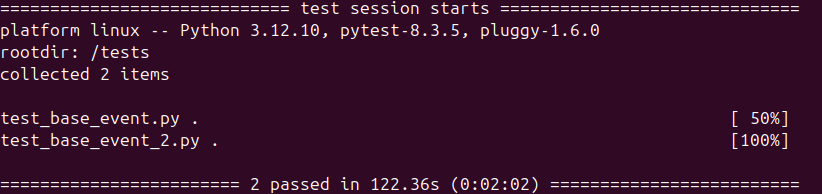
